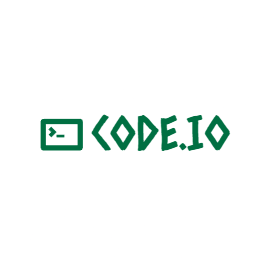

# Python Programming Repository - Code.io

<div align="center" style="display: flex; align-items: center; justify-content: center;">
  
  
</div>

Welcome to the Python Programming Practice Repository! This collection contains practical Python programs demonstrating fundamental concepts through complete implementations with detailed comments.

## 📋 Featured Programs

### 1. Core Concepts
- **Arguments.py**: Different argument types (positional, default, keyword, arbitrary)
- **Conditions.py**: If-else, elif, ternary operator, and match-case statements
- **Operators.py**: Arithmetic, assignment, comparison, logical, and membership operators
- **Strings.py**: String methods, indexing, and slicing operations
- **TypeCasting.py**: Type conversion between str/int/float/bool
- **Variables.py**: Variable declaration and data types
- **VariableScope.py**: Local, enclosed, global, and built-in scope

### 2. Practical Applications
- **Banking.py**: Interactive banking system
- **Calculator.py**: Basic arithmetic calculator
- **ShippingLabel.py**: Generate shipping labels using arbitrary arguments
- **ShoppingCart.py**: Shopping cart with list operations
- **TemperatureConverter.py**: Fahrenheit/Celsius conversion
- **WeightConverter.py**: Pounds/Kilograms conversion

### 3. Data Structures
- **Dictionary.py**: Dictionary operations and methods
- **List.py**: List manipulation and 2D lists
- **Sets.py**: Set operations and methods
- **Tuple.py**: Tuple indexing and methods
- **Iterables.py**: Iterating over different Python iterables

### 4. Games & Fun Projects
- **Dice.py**: ASCII art dice roller
- **NumberGuessingGame.py**: Number guessing game (1-10 range)
- **Quiz.py**: Multiple-choice quiz game
- **RockPaperScissor.py**: Rock-Paper-Scissors game (first to 3 wins)
- **SlotMachine.py**: Casino-style slot machine game

### 5. Formatting & I/O
- **FormatSpecifiers.py**: Advanced string formatting
- **Input.py**: User input handling
- **Output.py**: Print statement fundamentals
- **Random.py**: Random number generation techniques

### 6. Advanced Topics
- **Importer.py** & **NameMain.py**: `__name__ == "__main__"` usage
- **MathFunction.py**: Math module operations
- **Functions.py**: Function parameters and return values
- **Loops.py**: While/for loops with break/continue

## 🚀 How to Use This Repository

1. Browse programs by topic
2. Study the commented explanations at the top of each file
3. Clone the repository:
   ```bash
   git clone https://github.com/JhiteshGuptha/PYTHON-Code.io.git
4. Run any program:
   ```bash
   python filename.py

## 🚀 Using PyCharm IDE

PyCharm is recommended for optimal Python development experience:

### Setup Guide:
1. **Install PyCharm**: Download Community Edition from [jetbrains.com/pycharm](https://www.jetbrains.com/pycharm/download/)
2. **Create Project**:
   - `File > New Project`
   - Select location and Python interpreter
3. **Add Files**:
   - Right-click project folder > `New > Python File`
   - Copy-paste code from repository
4. **Run Programs**:
   - Right-click editor > `Run <filename>`
   - Use `Ctrl+Shift+F10` shortcut
   - View output in bottom console
5. **Debugging**:
   - Set breakpoints (click gutter area)
   - Start debug session (`Shift+F9`)
   - Inspect variables in debug window
6. **Version Control**:
   - `Git > Clone` to import repository
   - Use commit/update buttons in toolbar

### Recommended Settings:
```python
# Enable Scientific Mode for data exploration:
View -> Appearance -> Scientific Mode

# Configure keymaps:
File -> Settings -> Keymap

# Enable PEP8 inspections:
File -> Settings -> Editor -> Inspections -> Python