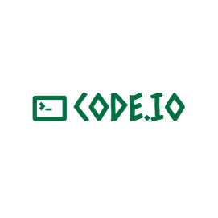

# Python Learning Repository - Code.io

<div align="center">
  
  
</div>

Welcome to the Python Learning Repository! This repository contains a comprehensive collection of Python concepts, examples, and practice programs designed to help beginners master core Python programming principles.

## 📚 Course Overview
This repository contains practical examples and implementations of fundamental Python concepts. Each concept is demonstrated through Python files that you can run directly in your Python environment.

## 📋 Topics Covered

### 1. Basic Syntax & Operations
**Files:** Output.py, Input.py, Operators.py, Variables.py  
**Concepts:**
- Basic output and input operations
- Variable declaration and usage
- Arithmetic, assignment, comparison, and logical operators
- Type conversion

### 2. Control Flow
**Files:** Conditions.py, Loops.py  
**Concepts:**
- Conditional statements (if, elif, else)
- While and for loops
- Loop control statements (break, continue)
- Nested loops

### 3. Data Structures
**Files:** List.py, Tuple.py, Sets.py, Dictionary.py  
**Concepts:**
- Lists, tuples, sets, and dictionaries
- Accessing and modifying elements
- Common methods and operations
- 2D data structures

### 4. String Operations
**Files:** Strings.py, FormatSpecifiers.py  
**Concepts:**
- String methods and manipulation
- String formatting and specifiers
- Indexing and slicing

### 5. Functions & Modules
**Files:** MathFunction.py, TypeCasting.py  
**Concepts:**
- Using built-in math functions
- Type conversion between data types
- Importing and using modules
- Common mathematical operations

### 6. Practical Applications
**Files:** Calculator.py, TemperatureConverter.py, WeightConverter.py, CompoundInterest.py  
**Concepts:**
- Building functional calculators
- Unit conversion programs
- Financial calculations

### 7. Practice Games
**Files:** MadLibs.py, Quiz.py  
**Concepts:**
- Interactive word games
- Quiz applications
- User input processing

### 8. Real-world Programs
**Files:** ConcessionStand.py, ShoppingCart.py, CountdownTimer.py  
**Concepts:**
- Dictionary-based menu systems
- Shopping cart implementations
- Timer applications

## 🛠️ Using PyCharm IDE
PyCharm is a powerful IDE for Python development. Here's how to use these files in PyCharm:

1. **Install PyCharm**: Download and install PyCharm Community Edition from [jetbrains.com/pycharm](https://www.jetbrains.com/pycharm/)

2. **Open Project**:
   - Launch PyCharm
   - Select "Open" and navigate to this repository's folder
   - Click "OK" to open the project

3. **Running Files**:
   - Right-click any Python file in the Project panel
   - Select "Run 'filename'"
   - View output in the Run panel at the bottom

4. **Key Features**:
   - Syntax highlighting
   - Code completion
   - Debugging tools
   - Integrated terminal
   - Version control integration

5. **Tips**:
   - Use Ctrl+Space for code completion
   - Right-click to refactor code
   - Set breakpoints by clicking the gutter to debug
   - Use the Python Console for quick experiments

## 🚀 How to Use This Repository
1. Clone the repository:
```bash
git clone https://github.com/your-username/Python-Code.io.git
